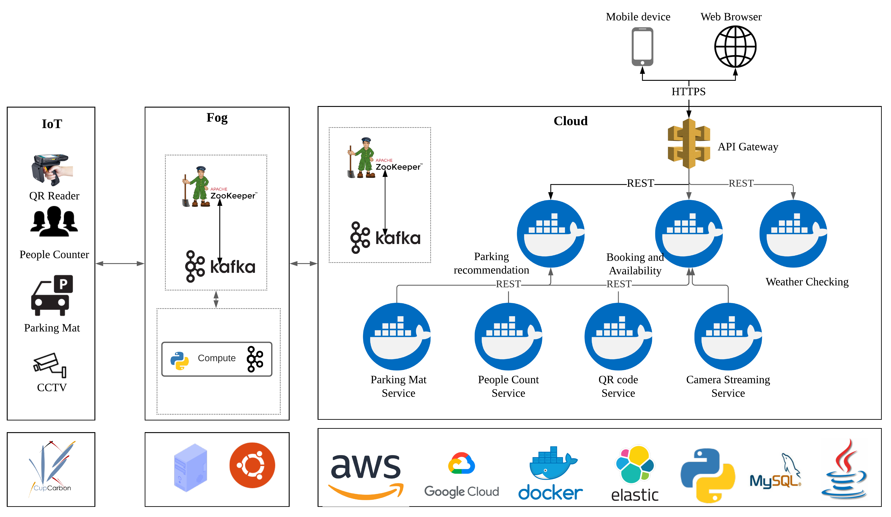

# ICSA2020_Submission90
This is the repository of the ICSA submission 90. The implementation details and result replication for M-View4Adapt framework are presensented below:

## Experiment Setup and System Configurations

The system consists of sensors deployed on the edge, lightweight computation distributed to a Fog and microservices deployed on the cloud. 

#### Microservice deployment Configurations

The microservices were deployed on two Google Cloud instances with different geographical zones.The first one was run on a N1-Standard-4 CPU Intel Haswell Processor comprising 4 vCPU and 16 GB RAM with US-Central-1a as the geographical zone and Ubuntu 20.04 LTS. The second one ran on a N2-Standard-4 Intel Skylake processor comprising 2 vCPU and 8 GB RAM with US-Central-1c as the geographical zone and Ubuntu 18.04 LTS.

#### Fog and IoT deployment Configurations

To emulate the edge layer setup, one desktop machine with 8 GB RAM and Intel 3rd Generation i5 (2.6 GHz quad core) with Ubuntu 16.04 LTS was used to run the CupCarbon simulation. Further, a Macbook pro with 16GB RAM and 8th Generation Intel i7 1.7 GHz (Quad Core) was used to deploy the Fog layer.

## XYZ Case Study Application Architecture

